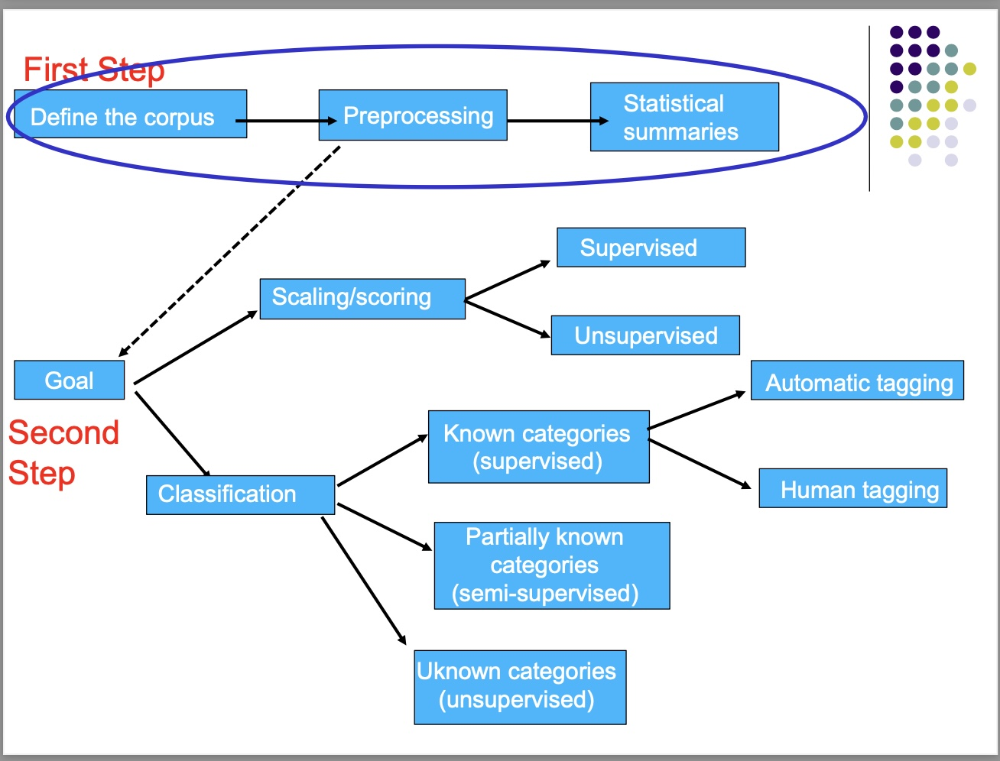
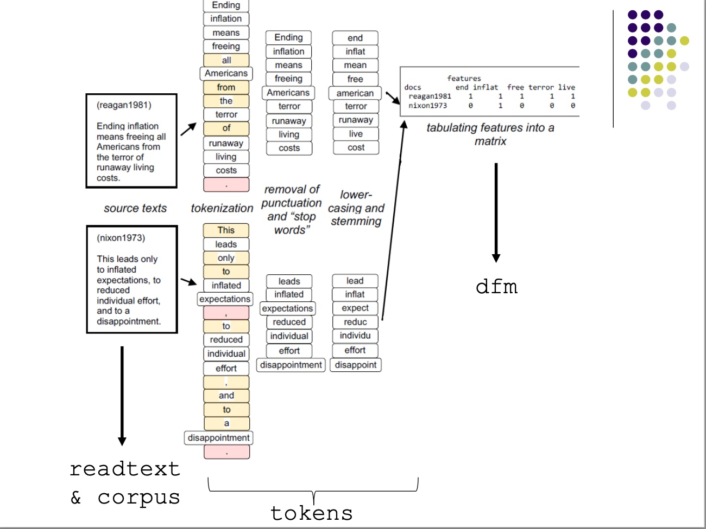

```{r SETUP, include=F}
knitr::opts_chunk$set(warning = F, collapse = T)
```


# Overview  

  
  
# First Step: Preparation  

## 1. Defining the Corpus  

### Vocabulary  

\begin{itemize}
\item[*text*:] unit of analysis. Also called *document*. E.g., sentence, paragraph, tweet, press briefing, facebook status, etc.   
\item[*types*:] number of unique terms.  
\item[*tokens*:] number of words.  
\item[*corpus*:] collection of *texts* to be analyzed. E.g., a year of articles about the economy from NYT, unit of analysis being a single article.     
\item[*corpora*:] collection of *corpus*.
\end{itemize}  

###  Defining the corpus  

**Acquire the texts**  
- Once you define the corpus based on your research question, you must acquire relevant texts (minimize flase negatives) and exclude irrelevant texts (minimize false positives).  

**Convert texts**  
- Convert texts into online corpus using `readtext`.  
```{r results=F, collapse = TRUE}
library(readtext)
library(quanteda)
```
```{r collapse = TRUE}
# read csv
# step 1: read csv as text using readtext
boston_tweets <- readtext("data/boston.csv", text_field = "text") # specify the column containing the texts.  
# step 2: load the corpus  
boston_corpus <- corpus(boston_tweets)
# step 3: useful functions 
ndoc(boston_corpus) # counts number of texts (documents) in corpus  
strwrap(as.character(boston_corpus)[1]) # prints first text of corpus
```
```{r}
head(summary(boston_corpus)) # summary of corpus 
```

```{r}
# read txt file 
# lint filenames to add variables (column names)
speeches <- readtext("data/inaugural_speeches/*.txt", 
docvarsfrom = "filenames", dvsep = "_", docvarnames = c("Name", "Surname", "Year"))
# load corpus
speeches_corpus <- corpus(speeches)
# add docvars 
speeches_corpus$index <- 1:5
head(docvars(speeches_corpus))
# subsetting corpus 
speeches_corpus_gt1800 <- corpus_subset(speeches_corpus, Year > 1800)
```


## 2. Preprocessing  

### Vocabulary  

\begin{itemize}
\item[*tokens*:] words as they occur in a text. The text "one two one two" contains four tokens.  
\item[*types*:] unique tokens. The text "one two one two" contains two types. 
\item[*feature*:] preprocessed token. Unit of analysis.  
\item[*stopwords*:] preprositions, pronouns, conjunctions, words that do not add value and occur redundantly. 
\item[*bag of words*:] unordered tokens. 
\item[*n-gram*:] sequence of n words.  
\item[*dfm*:] Document feature matrix. Counts frequency of word types of each document.  
\item[*One hot encoding*:] Creating a dfm with 0/1 values indicating whether word type is in the document. 
\end{itemize}  

### Preprocessing  

**Tokenization**  
- Split text into tokens by recognizing delimiters (e.g., whitespace), or following set rules (Japanese, Chinese). Use `tokens` command.  
```{r}
tokenized_boston_corpus <- tokens(boston_corpus)
```


**Noise removal**  
- Remove redundant tokens that do not add value. E.g., *stopwords*, punctuation, capitalization, words with low relative frequency.  
```{r}
# lower case enabled by default
noise_removed_tokens_corpus <- tokens(boston_corpus, 
                                      remove_punct = T, 
                                      remove_numbers=T, 
                                      remove_symbols = T, 
                                      split_hyphens = T, 
                                      remove_separators = T, 
                                      remove_url=T)
# remove stop words
# for asian languages, use source = "marimo"
noise_removed_tokens_corpus <- tokens_remove(noise_removed_tokens_corpus,
                                             stopwords("en"))
# check top 20 features
topfeatures(dfm(noise_removed_tokens_corpus), 20)
# remove additional words
noise_removed_tokens_corpus <- tokens_remove(noise_removed_tokens_corpus, c(("rt"), ("00*"), ("ed"), ("u")))
```


**Normalization**  

* *Stemming*: reduces tokens to their stems (canonical form), ignoring differences in inflected forms. E.g., taxes, taxation, taxable, all stem from tax.   
* *Lemmatization*: reduces tokens to root of the word through morphological analysis. E.g., runs, running, ran, would all be run. With stemming, ran would remain ran.  
```{r}
# stem the tokens 
stemmed_tokens_corpus <- tokens_wordstem(noise_removed_tokens_corpus, language =("english"))
```

**Discard order**  
- Discard order of words and convert to *bag of words* Often, discarding the order of words to analyze *unigrams* yields sufficiently interesting results.  
- *n-grams* retain some order even in the *bag of words* approach. However, in practice, they don't always improve results.     

**Document Feature Matrix**  
- Tokens from a document are put into vectors that count the number of appearances of each word type. Multiple word vectors are combined into a *document-feature matrix*, where each row represents a document and each column represents a word type (unique word).   
- *One-hot encoding*: a list of 0/1: where 0 = word not present in that document and 1 vice-versa.  
- Dfms often end up becoming *sparse* and are affected by the *curse of dimensionality*. *Trim* the dfm (e.g. filter to features that appear in 10% of documents or less). 

```{r results = F}
library(ggplot2)
library(quanteda.textstats)
```

```{r collapse=T}
# create dfm
boston_dfm <- dfm(stemmed_tokens_corpus)
# check top features
topfeatures(boston_dfm, 10)
# plot frequency of top 10 features
topfeature_frequency <- textstat_frequency(boston_dfm, n = 20)
ggplot(topfeature_frequency) + 
       aes(x = reorder(feature, frequency), y = frequency) +
       geom_point() +
       coord_flip() +
       theme(axis.text.x = element_text(angle = 90, hjust = 1))
```
```{r}
# filter dfm to specific patterns  
boston_hashtag_dfm <- dfm_select(boston_dfm, pattern = c("#*"))
topfeatures(boston_hashtag_dfm, 5)
# exclude patterns from dfm  
boston_no_hashtag_dfm <- dfm_remove(boston_dfm, pattern = c("#*"))
topfeatures(boston_no_hashtag_dfm, 5)
```

```{r collapse = T}
# trim the dfm  
# keep words occuring >= 10 times and in >= 2 documents
dfm_trim(boston_dfm, min_termfreq = 10, min_docfreq = 2)
# keep words occuring <= 10 times and in less than 40% of documents
dfm_trim(boston_dfm, max_termfreq = 10, max_docfreq = 0.4, docfreq_type = "prop")
```

```{r}
tokenized_speeches <- tokens(speeches_corpus,  
                             remove_punct = TRUE, 
                             remove_numbers=TRUE, 
                             remove_symbols = TRUE, 
                             split_hyphens = TRUE, 
                             remove_separators = TRUE)
tokenized_speeches <- tokens_remove(tokenized_speeches , stopwords("en"))
stemmed_speeches <- tokens_wordstem(tokenized_speeches)
speeches_dfm <- dfm(stemmed_speeches)
topfeatures(speeches_dfm , 5, groups = Surname) # group by 
```


## 3. Statistical Summaries  

### Keywords in Context  
Find keywords in context and plot lexical dispersion (position of words within documents).  

```{r collapse=T}
## kwic (keywords in context)
# by single word or pattern
kwic(tokens(data_corpus_inaugural), "terror*", window = 5)
# by phrase 
kwic(tokens(data_corpus_inaugural), phrase("by terror"), window = 5)

# plotting kwic as a lexical dispersion plot (ggplot object)
library(quanteda.textplots)
textplot_xray(
  kwic(tokens(data_corpus_inaugural[40:59]), "american"),
  kwic(tokens(data_corpus_inaugural[40:59]), "people"),
  kwic(tokens(data_corpus_inaugural[40:59]), "communis*")
) +
  aes(color = keyword)
```

### Tagcloud  
Plot words in a word cloud based on their frequency.  
```{r}
# tagcloud  
textplot_wordcloud(speeches_dfm, min_count = 5)
# preprocessing 
recent_presidents_corpus <- corpus_subset(data_corpus_inaugural, 
                                          President %in% c("Biden", "Trump", "Obama"))
recent_presidents_tokens <- tokens(recent_presidents_corpus, 
                                   remove_punct = TRUE, 
                                   remove_numbers=TRUE, 
                                   remove_symbols = TRUE, 
                                   split_hyphens = TRUE, 
                                   remove_separators = TRUE)
recent_presidents_tokens <- tokens_remove(recent_presidents_tokens, stopwords("en"))
recent_presidents_dfm <- dfm(recent_presidents_tokens)
recent_presidents_dfm <- dfm_group(recent_presidents_dfm, groups = President)
recent_presidents_dfm <- dfm_trim(recent_presidents_dfm, min_termfreq = 6)
# plotting
textplot_wordcloud(recent_presidents_dfm, comparison = TRUE)
```

### Lexical Diversity  

The diversity of tokens employed in a document. For example, it is argued that populist communication means simplified political discourse (lowered diversity), in an attempt to reach the public more easily.  
$$\text{TTR} =  \text{V} / \text{N}$$
$$\text{V} = \text{total number of unique tokens in the document}, \;\text{N}= \text{total number of tokens in the corpus}$$

```{r}
# lexical diversity  
recent_presidents_corpus <- corpus_subset(data_corpus_inaugural, 
                                          President %in% c("Biden", "Trump", "Obama"))
recent_presidents_tokens <- tokens(recent_presidents_corpus, 
                                   remove_punct = TRUE, 
                                   remove_numbers=TRUE, 
                                   remove_symbols = TRUE, 
                                   split_hyphens = TRUE, 
                                   remove_separators = TRUE)
recent_presidents_tokens <- tokens_remove(recent_presidents_tokens, stopwords("en"))
recent_presidents_dfm <- dfm(recent_presidents_tokens)
speeches_lexdiv <- textstat_lexdiv(recent_presidents_dfm)

# plot 
ggplot(speeches_lexdiv) +
  aes(x=document, y=TTR, group=1) +
  geom_line() +
  geom_point() +
  theme_minimal()
```

### Target Group vs Reference Group  

More sophisticated methods compare the differential occurrences of words across texts or partitions of a corpus, using statistical association measures, to identify the words that belong for example to different sub-groups of texts, such as those predominantly  associated for example with male - versus female - authored documents. We can use a [chi-squared test](http://www.luigicurini.com/uploads/6/7/9/8/67985527/lab_1_extra_a_2022_chi2_extra.pdf) for such comparisons to see if their is a statistically significant difference. 

```{r}
# prepare corpus 
GOP_corpus <- corpus_subset(data_corpus_inaugural, Year > 1946 & Party== "Republican")
GOP_corpus$Trump <- ifelse(GOP_corpus$President=="Trump", "Trump", "Other")
GOP_tokens <- tokens(GOP_corpus, 
                     remove_punct = TRUE, 
                     remove_numbers=TRUE, 
                     remove_symbols = TRUE, 
                     split_hyphens = TRUE, 
                     remove_separators = TRUE)
GOP_tokens <- tokens_remove(GOP_tokens, stopwords("en"))
GOP_tokens_stemmed <- tokens_wordstem(GOP_tokens)
GOP_dfm <- dfm(GOP_tokens_stemmed)
GOP_Trump_dfm <- dfm_group(GOP_dfm, groups = Trump)
# find similarity between Trump and other GOP presidents 
GOP_Trump_keyness <- textstat_keyness(GOP_Trump_dfm , target = "Trump")
# keep only significant values 
GOP_Trump_keyness <- GOP_Trump_keyness[GOP_Trump_keyness$p <= 0.05, ]
# plot 
textplot_keyness(GOP_Trump_keyness)
```

### Cosine Similarity  
[Cosine similarity](http://www.luigicurini.com/uploads/6/7/9/8/67985527/lab_1_extra_b_2022_cosine_similarity_extra.pdf) is an intuitive measure of semantic similarity. More in details, the cosine similarity between two texts ranges between 0 and 1, where 0 is reached when two texts are completely  different and 1 is reached when two texts have identical feature proportions. 

```{r}
GOP_cos_sim <- textstat_simil(GOP_dfm, 
                             margin = "documents", 
                             method = "cosine")
# plotting 
library(corrplot)
GOP_cos_sim <-as.matrix(GOP_cos_sim)
corrplot(GOP_cos_sim, method = 'number')
corrplot(GOP_cos_sim, method = 'shade') # set `type = lower` for just lower half
```

